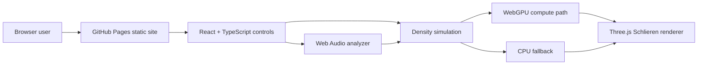

# Schlieren Imaging Simulator

[Live site](https://baditaflorin.github.io/schlieren-imaging-simulator/) · [Repository](https://github.com/baditaflorin/schlieren-imaging-simulator) · [Support the project](https://www.paypal.com/paypalme/florinbadita)

Browser-based Schlieren simulator for visualizing heat, sound, and gas density gradients with WebGPU and Three.js.

## Quickstart

```sh
npm install
make install-hooks
make dev
make test
make build
```

## What It Does

Schlieren imaging reveals refractive-index changes caused by density gradients in transparent media. This project turns that idea into a browser-native teaching tool for heat plumes, sound waves, and gas leaks.

The v1 app is designed for GitHub Pages. It uses WebGPU compute shaders when available, falls back gracefully when unavailable, renders synthetic scenes with Three.js, and uses Web Audio for live or uploaded audio analysis.

## Architecture



## Commands

```sh
make help
make dev
make lint
make test
make build
make smoke
make pages-preview
```

## Documentation

- ADRs: `docs/adr/`
- Architecture: `docs/architecture.md`
- Deployment: `docs/deploy.md`
- Privacy: `docs/privacy.md`
- Postmortem: `docs/postmortem.md`

## Deployment

The built GitHub Pages site lives in `docs/` and is served from the `main` branch `/docs` folder.

Complete live URL: https://baditaflorin.github.io/schlieren-imaging-simulator/

Complete repository URL: https://github.com/baditaflorin/schlieren-imaging-simulator
