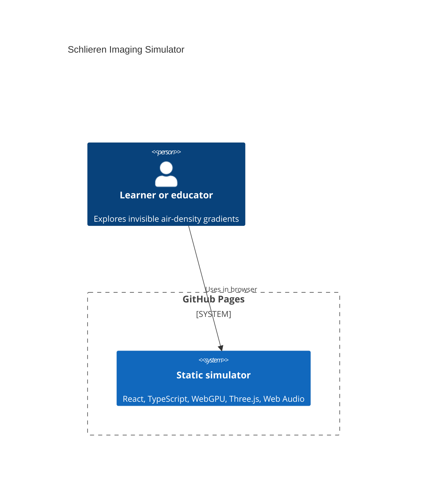
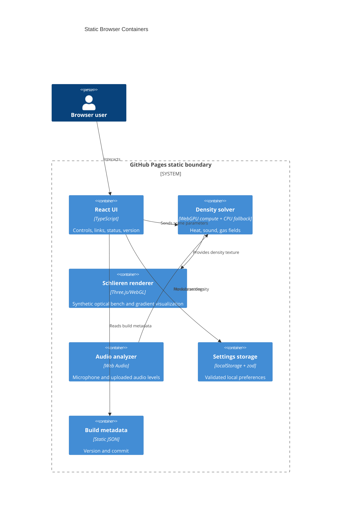

# Architecture

## Context

## Container

## Boundaries

- `src/features/simulation/` owns the density-field model, WebGPU compute shader, and CPU fallback.
- `src/features/rendering/` owns the Three.js viewport and Schlieren shader.
- `src/features/audio/` owns microphone, uploaded audio playback, and meter state.
- `src/features/settings/` owns localStorage persistence and zod validation.
- `docs/` contains both GitHub Pages output and project documentation; the build cleaner preserves documentation files.

Complete live URL: https://baditaflorin.github.io/schlieren-imaging-simulator/

Complete repository URL: https://github.com/baditaflorin/schlieren-imaging-simulator
